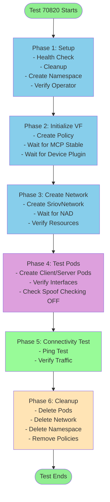
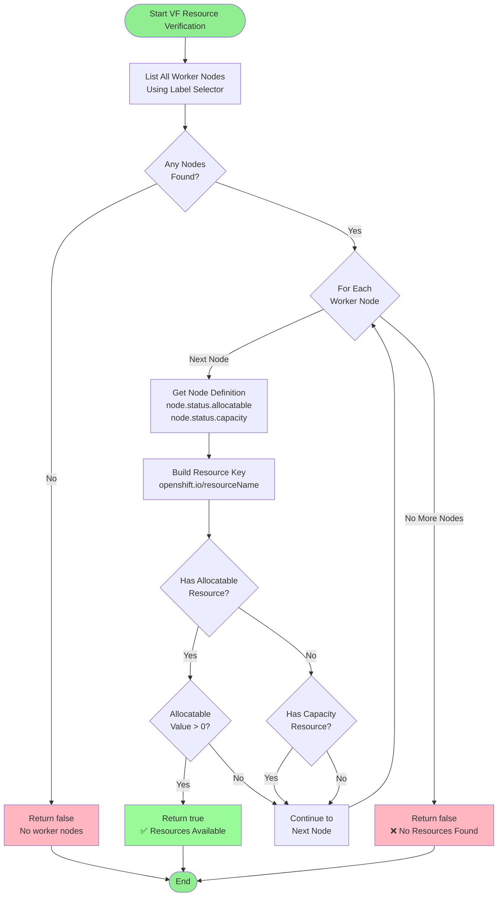
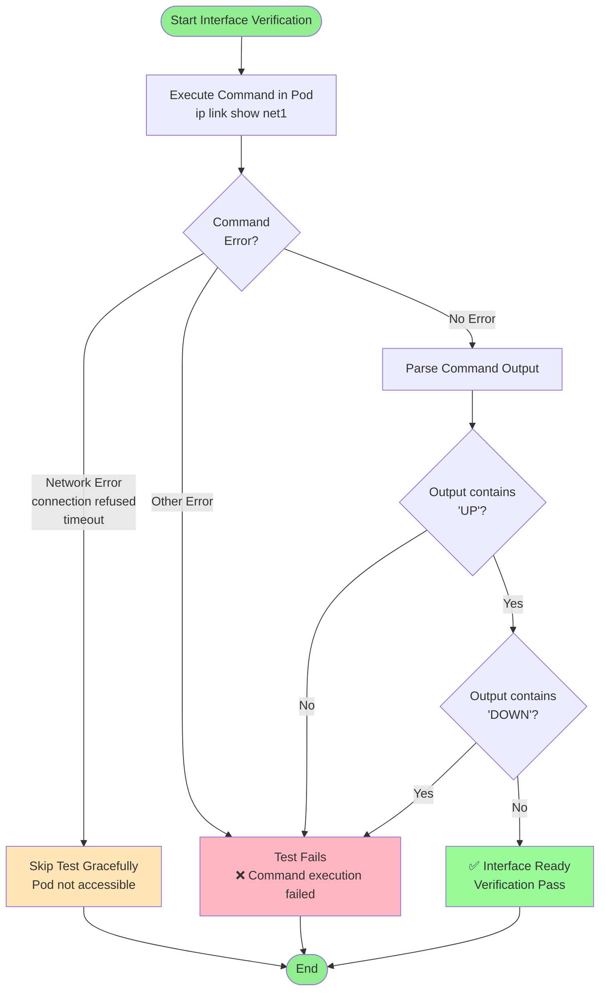
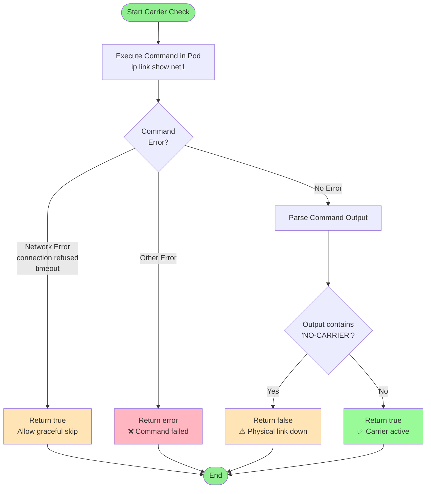
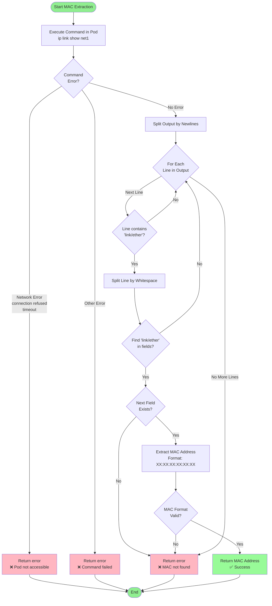
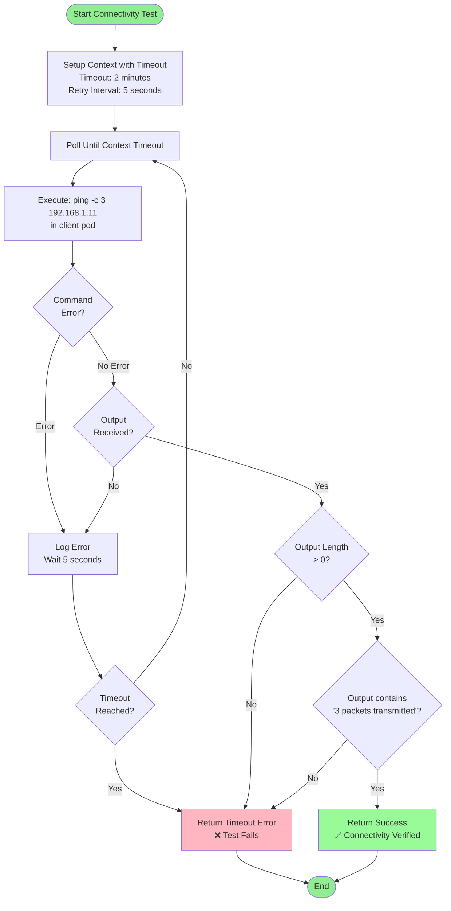

# Test 70820: SR-IOV VF with Spoof Checking Disabled - Detailed Flowchart

This document contains a detailed Mermaid flowchart for test case 70820: "SR-IOV VF with spoof checking disabled".

## High-Level Flowchart (Simplified)



## Detailed Flowchart

```mermaid
flowchart TD
    Start([Test 70820 Starts]) --> BeforeSuite[BeforeSuite: Setup]
    
    BeforeSuite --> HealthCheck[Run Cluster Health Check]
    HealthCheck --> Cleanup[Cleanup Leftover Resources]
    Cleanup --> CreateTestNS[Create Test Namespace<br/>with Privileged Labels]
    CreateTestNS --> VerifySRIOV[Verify SR-IOV Operator<br/>is Deployed]
    VerifySRIOV --> PullImages[Pull Test Images<br/>on Worker Nodes]
    PullImages --> BeforeEach[BeforeEach: Per-Test Setup]
    
    BeforeEach --> CheckOperator[Check SR-IOV Operator Status]
    CheckOperator --> DiscoverNodes[Discover Worker Nodes]
    DiscoverNodes --> LoopStart{For Each Device<br/>in testData}
    
    LoopStart -->|Next Device| InitVF[initVF: Initialize VF]
    LoopStart -->|No More Devices| SkipTest[Skip: No SR-IOV devices<br/>matched configuration]
    
    InitVF --> VerifyWorkers[Verify Worker Nodes<br/>are Stable and Ready]
    VerifyWorkers -->|Not Ready| InitVFFail[Return false<br/>Continue to next device]
    VerifyWorkers -->|Ready| CleanupConflicts[Cleanup Conflicting Policies]
    
    CleanupConflicts --> CreatePolicy[Create SriovNetworkNodePolicy<br/>- Name: device.Name<br/>- ResourceName: device.Name<br/>- NumVfs: vfNum<br/>- PfNames: interfaceName#0-vfNum-1<br/>- NodeSelector: kubernetes.io/hostname<br/>- DeviceType: netdevice]
    
    CreatePolicy -->|Create Failed| CleanupPolicy[Cleanup Policy<br/>Continue to next node]
    CreatePolicy -->|Success| WaitMCP[Wait for SR-IOV and MCP Stable<br/>Timeout: 20 minutes<br/>Check Interval: 30 seconds]
    
    WaitMCP -->|Timeout| CleanupPolicy
    WaitMCP -->|Success| WaitDevicePlugin[Wait for Device Plugin<br/>Resource Pool<br/>Timeout: 2 minutes]
    
    WaitDevicePlugin -->|Timeout| RestartPlugin[Restart Device Plugin Pod]
    RestartPlugin --> WaitDevicePlugin2[Wait Again for Resource Pool<br/>Timeout: 2 minutes]
    WaitDevicePlugin2 -->|Still Timeout| WarnContinue[Log Warning<br/>Continue Anyway]
    WaitDevicePlugin -->|Success| InitVFSuccess[Return true<br/>VF Initialized]
    WaitDevicePlugin2 -->|Success| InitVFSuccess
    WarnContinue --> InitVFSuccess
    
    InitVFFail --> LoopStart
    CleanupPolicy --> LoopStart
    
    InitVFSuccess -->|Return false| LoopStart
    InitVFSuccess -->|Return true| SetExecuted[Set executed = true]
    
    SetExecuted --> CreateNS[Create Test Namespace<br/>Name: e2e-70820-deviceName<br/>With Privileged Labels]
    CreateNS --> WaitNS[Wait for Namespace Ready<br/>Timeout: 30 seconds]
    WaitNS --> CreateNetwork[Create SriovNetwork<br/>- Name: 70820-deviceName<br/>- ResourceName: device.Name<br/>- NetworkNamespace: e2e-70820-deviceName<br/>- SpoofChk: off<br/>- Trust: on<br/>- IPAM: static<br/>- MAC Support: enabled<br/>- IP Support: enabled]
    
    CreateNetwork --> VerifyNetwork[Verify SriovNetwork Created]
    VerifyNetwork --> VerifyPolicy[Verify SriovNetworkNodePolicy Exists<br/>Timeout: 30 seconds<br/>Check Interval: 2 seconds]
    
    VerifyPolicy -->|Policy Not Found| FailPolicy[Test Fails:<br/>Policy must exist]
    VerifyPolicy -->|Policy Found| WaitNAD[Wait for NetworkAttachmentDefinition<br/>to be Created by Operator<br/>Timeout: 5 minutes<br/>WORKAROUND: Fallback to manual<br/>creation if operator fails]
    
    WaitNAD -->|NAD Creation Failed| FailNAD[Test Fails:<br/>NAD creation failed<br/>OCPBUGS-64886]
    WaitNAD -->|NAD Created| VerifyVFResources[Verify VF Resources Available<br/>on Worker Nodes<br/>Timeout: 5 minutes<br/>Check Interval: 5 seconds]
    
    VerifyVFResources -->|Resources Not Available| FailResources[Test Fails:<br/>VF resources not available]
    VerifyVFResources -->|Resources Available| CheckVFStatus[chkVFStatusWithPassTraffic]
    
    %% Detailed VF Resource Verification Sub-flow
    VerifyVFResources -.->|Details| VFResDetail[VF Resource Verification Details]
    VFResDetail --> VFResLoop{For Each<br/>Worker Node}
    VFResLoop --> VFResCheck[Check Node Allocatable Resources<br/>Resource Key: openshift.io/resourceName]
    VFResCheck --> VFResHasAlloc{Has Allocatable<br/>Resource?}
    VFResHasAlloc -->|Yes| VFResQty{Allocatable<br/>> 0?}
    VFResQty -->|Yes| VFResSuccess[Return true<br/>Resources Available]
    VFResQty -->|No| VFResNext[Continue to Next Node]
    VFResHasAlloc -->|No| VFResCheckCap{Has Capacity<br/>Resource?}
    VFResCheckCap -->|Yes| VFResNext
    VFResCheckCap -->|No| VFResNext
    VFResNext --> VFResLoop
    VFResLoop -->|No More Nodes| VFResFail[Return false<br/>No Resources Found]
    
    CheckVFStatus --> CreateClientPod[Create Client Pod<br/>- Name: client<br/>- Network: networkName<br/>- IP: 192.168.1.10/24<br/>- MAC: 20:04:0f:f1:88:01<br/>- Privileged: true]
    CreateClientPod --> CreateServerPod[Create Server Pod<br/>- Name: server<br/>- Network: networkName<br/>- IP: 192.168.1.11/24<br/>- MAC: 20:04:0f:f1:88:02<br/>- Privileged: true]
    
    CreateServerPod --> WaitClient[Wait for Client Pod Ready<br/>Timeout: 300 seconds]
    WaitClient -->|Not Ready| CollectClientDiag[Collect Client Pod Diagnostics]
    CollectClientDiag --> FailClient[Test Fails:<br/>Client pod not ready]
    
    WaitClient -->|Ready| WaitServer[Wait for Server Pod Ready<br/>Timeout: 300 seconds]
    WaitServer -->|Not Ready| CollectServerDiag[Collect Server Pod Diagnostics]
    CollectServerDiag --> FailServer[Test Fails:<br/>Server pod not ready]
    
    WaitServer -->|Ready| VerifyClientIface[Verify Client Interface Ready<br/>Interface: net1<br/>Check: ip link show net1<br/>Must be UP]
    VerifyClientIface -->|Not Ready| FailIface[Test Fails:<br/>Interface not ready]
    
    %% Detailed Interface Verification Sub-flow
    VerifyClientIface -.->|Details| IfaceDetail[Interface Verification Details]
    IfaceDetail --> IfaceExec[Execute: ip link show net1<br/>in pod container]
    IfaceExec --> IfaceCheckErr{Command<br/>Error?}
    IfaceCheckErr -->|Network Error| IfaceSkip[Skip Test:<br/>Pod not accessible]
    IfaceCheckErr -->|Other Error| FailIface
    IfaceCheckErr -->|No Error| IfaceParse[Parse Output<br/>Check for 'UP' status]
    IfaceParse --> IfaceHasUP{Output contains<br/>'UP'?}
    IfaceHasUP -->|Yes| IfaceNoDOWN{Output contains<br/>'DOWN'?}
    IfaceHasUP -->|No| FailIface
    IfaceNoDOWN -->|Yes| FailIface
    IfaceNoDOWN -->|No| IfaceSuccess[Interface Ready<br/>Verification Pass]
    
    VerifyClientIface -->|Ready| VerifyServerIface[Verify Server Interface Ready<br/>Interface: net1<br/>Check: ip link show net1<br/>Must be UP]
    VerifyServerIface -->|Not Ready| FailIface
    
    VerifyServerIface -->|Ready| CheckCarrier[Check Interface Carrier Status<br/>Check: ip link show net1<br/>Look for NO-CARRIER]
    
    %% Detailed Carrier Check Sub-flow
    CheckCarrier -.->|Details| CarrierDetail[Carrier Status Check Details]
    CarrierDetail --> CarrierExec[Execute: ip link show net1<br/>in pod container]
    CarrierExec --> CarrierCheckErr{Command<br/>Error?}
    CarrierCheckErr -->|Network Error| CarrierReturnTrue[Return true<br/>Allow graceful skip]
    CarrierCheckErr -->|Other Error| CarrierFail[Return error]
    CarrierCheckErr -->|No Error| CarrierParse[Parse Output<br/>Check for 'NO-CARRIER']
    CarrierParse --> CarrierHasNoCarrier{Output contains<br/>'NO-CARRIER'?}
    CarrierHasNoCarrier -->|Yes| CarrierReturnFalse[Return false<br/>No Carrier]
    CarrierHasNoCarrier -->|No| CarrierReturnTrue
    
    CheckCarrier -->|NO-CARRIER| SkipConnectivity[Skip Connectivity Test:<br/>Physical link down]
    CheckCarrier -->|Carrier OK| ExtractMAC[Extract Client Pod MAC Address<br/>from net1 interface]
    
    %% Detailed MAC Extraction Sub-flow
    ExtractMAC -.->|Details| MACDetail[MAC Address Extraction Details]
    MACDetail --> MACExec[Execute: ip link show net1<br/>in pod container]
    MACExec --> MACCheckErr{Command<br/>Error?}
    MACCheckErr -->|Network Error| MACFail[Return error:<br/>Pod not accessible]
    MACCheckErr -->|Other Error| MACFail
    MACCheckErr -->|No Error| MACParse[Parse Output<br/>Look for 'link/ether']
    MACParse --> MACFind{Found<br/>'link/ether'?}
    MACFind -->|No| MACFail
    MACFind -->|Yes| MACExtract[Extract MAC from<br/>next field after 'link/ether'<br/>Format: XX:XX:XX:XX:XX:XX]
    MACExtract --> MACValidate{MAC Format<br/>Valid?}
    MACValidate -->|Yes| MACSuccess[Return MAC Address]
    MACValidate -->|No| MACFail
    
    ExtractMAC -->|Failed| FailMAC[Test Fails:<br/>Failed to extract MAC]
    ExtractMAC -->|Success| RefreshPod[Refresh Pod Definition<br/>to Get Node Name]
    
    RefreshPod --> VerifySpoofCheck[Verify Spoof Checking on VF<br/>- Node: clientPodNode<br/>- Interface: interfaceName<br/>- MAC: clientMAC<br/>- Expected: spoof checking OFF]
    
    %% Detailed Spoof Checking Verification Sub-flow
    VerifySpoofCheck -.->|Details| SpoofDetail[Spoof Checking Verification Details]
    SpoofDetail --> SpoofValidateNode{Node Name<br/>Empty?}
    SpoofValidateNode -->|Yes| SpoofFail[Test Fails:<br/>Node name empty]
    SpoofValidateNode -->|No| SpoofValidateIface{Interface Name<br/>Empty?}
    SpoofValidateIface -->|Yes| SpoofFail
    SpoofValidateIface -->|No| SpoofValidateMAC{MAC Address<br/>Empty?}
    SpoofValidateMAC -->|Yes| SpoofFail
    SpoofValidateMAC -->|No| SpoofLogCmd[Log Diagnostic Command:<br/>oc debug node/NODE -- chroot /host sh -c<br/>'ip link show INTERFACE | grep -i spoof']
    SpoofLogCmd --> SpoofNote[Note: Actual verification requires<br/>executing command on node<br/>Current implementation validates setup only]
    SpoofNote --> SpoofSuccess[Verification Setup Complete<br/>All prerequisites validated]
    
    VerifySpoofCheck --> TestConnectivity[Test Connectivity<br/>Command: ping -c 3 192.168.1.11<br/>Timeout: 2 minutes<br/>Retry Interval: 5 seconds]
    
    %% Detailed Ping Test Verification Sub-flow
    TestConnectivity -.->|Details| PingDetail[Ping Test Verification Details]
    PingDetail --> PingSetup[Setup Context with Timeout<br/>Timeout: 2 minutes<br/>Retry Interval: 5 seconds]
    PingSetup --> PingLoop[Poll Until Context Timeout]
    PingLoop --> PingExec[Execute: ping -c 3 192.168.1.11<br/>in client pod]
    PingExec --> PingCheckErr{Command<br/>Error?}
    PingCheckErr -->|Error| PingLogRetry[Log Error and Retry<br/>Wait 5 seconds]
    PingCheckErr -->|No Error| PingCheckOutput{Output<br/>Received?}
    PingLogRetry --> PingCheckTimeout{Timeout<br/>Reached?}
    PingCheckTimeout -->|Yes| PingTimeoutFail[Return Timeout Error]
    PingCheckTimeout -->|No| PingLoop
    PingCheckOutput -->|No| PingLogRetry
    PingCheckOutput -->|Yes| PingSuccess[Return Success]
    
    TestConnectivity -->|Timeout| FailPing[Test Fails:<br/>Ping timeout]
    TestConnectivity -->|Failed| RetryPing[Retry Ping<br/>Max: 2 minutes]
    RetryPing --> TestConnectivity
    
    TestConnectivity -->|Success| VerifyPingOutput[Verify Ping Output<br/>Must contain:<br/>'3 packets transmitted']
    
    %% Detailed Ping Output Verification Sub-flow
    VerifyPingOutput -.->|Details| PingOutputDetail[Ping Output Verification Details]
    PingOutputDetail --> PingOutputCheckLen{Output Length<br/>> 0?}
    PingOutputCheckLen -->|No| PingOutputFail[Test Fails:<br/>Empty output]
    PingOutputCheckLen -->|Yes| PingOutputCheckSub{Output contains<br/>'3 packets transmitted'?}
    PingOutputCheckSub -->|No| PingOutputFail
    PingOutputCheckSub -->|Yes| PingOutputSuccess[Ping Verification Pass<br/>Connectivity Confirmed]
    
    VerifyPingOutput -->|Invalid| FailPing
    VerifyPingOutput -->|Valid| CleanupPods[Cleanup Test Pods<br/>- Delete client pod<br/>- Delete server pod<br/>Timeout: 60 seconds each]
    
    CleanupPods --> CleanupNetwork[Cleanup SriovNetwork<br/>Defer: rmSriovNetwork]
    CleanupNetwork --> CleanupNS[Cleanup Namespace<br/>Defer: DeleteAndWait<br/>Timeout: 120 seconds]
    
    CleanupNS --> AfterEach[AfterEach: Cleanup Policies]
    AfterEach --> RemovePolicies[Remove All SR-IOV Policies<br/>for testData devices]
    RemovePolicies --> WaitPolicyReady[Wait for SR-IOV Policy Ready]
    WaitPolicyReady --> LoopStart
    
    SkipConnectivity --> CleanupPods
    SkipTest --> AfterSuite[AfterSuite: Final Cleanup]
    CleanupNS --> AfterSuite
    
    AfterSuite --> DeleteTestNS[Delete Test Namespace<br/>Timeout: 300 seconds]
    DeleteTestNS --> End([Test 70820 Ends])
    
    FailPolicy --> CleanupNS
    FailNAD --> CleanupNS
    FailResources --> CleanupNS
    FailClient --> CleanupNS
    FailServer --> CleanupNS
    FailIface --> CleanupNS
    FailMAC --> CleanupNS
    FailPing --> CleanupNS
    
    style Start fill:#90EE90
    style End fill:#90EE90
    style FailPolicy fill:#FFB6C1
    style FailNAD fill:#FFB6C1
    style FailResources fill:#FFB6C1
    style FailClient fill:#FFB6C1
    style FailServer fill:#FFB6C1
    style FailIface fill:#FFB6C1
    style FailMAC fill:#FFB6C1
    style FailPing fill:#FFB6C1
    style SkipConnectivity fill:#FFE4B5
    style SkipTest fill:#FFE4B5
    style WaitNAD fill:#87CEEB
    style VerifySpoofCheck fill:#DDA0DD
    style TestConnectivity fill:#98FB98
```

## Key Test Configuration

### Test Parameters
- **Test ID**: 70820
- **Test Name**: SR-IOV VF with spoof checking disabled
- **Spoof Checking**: `off`
- **Trust**: `on`
- **Device Type**: `netdevice`
- **VF Count**: Configurable via `SRIOV_VF_NUM` (default: 2)

### Network Configuration
- **Client Pod IP**: 192.168.1.10/24
- **Server Pod IP**: 192.168.1.11/24
- **Client Pod MAC**: 20:04:0f:f1:88:01
- **Server Pod MAC**: 20:04:0f:f1:88:02
- **Interface Name**: net1 (inside pod)

### Timeouts
- **MCP Stable Wait**: 20 minutes
- **Device Plugin Resource Pool**: 2 minutes
- **NAD Creation**: 5 minutes
- **VF Resources Available**: 5 minutes
- **Pod Ready**: 300 seconds (5 minutes)
- **Ping Test**: 2 minutes
- **Namespace Cleanup**: 120 seconds

### Key Functions

1. **initVF**: Creates SR-IOV policy and waits for it to be applied
2. **createSriovNetwork**: Creates SriovNetwork resource with spoof checking disabled
3. **chkVFStatusWithPassTraffic**: Creates test pods, verifies interface, and tests connectivity
4. **verifyVFSpoofCheck**: Verifies that spoof checking is disabled on the VF

### Workarounds

- **OCPBUGS-64886**: If operator fails to create NAD within 5 minutes, test falls back to manual NAD creation (with limitations)

### Cleanup

- All resources are cleaned up in defer statements
- Policies are removed in AfterEach
- Namespace is deleted in defer and AfterSuite

## Detailed Verification Logic

### 1. VF Resource Verification (`verifyVFResourcesAvailable`)

**Purpose**: Verify that VF resources are advertised and available on worker nodes.

**Mermaid Flowchart**:



**Process**:
1. List all worker nodes using label selector
2. For each worker node:
   - Check `node.status.allocatable` for resource key `openshift.io/{resourceName}`
   - Check `node.status.capacity` for resource key `openshift.io/{resourceName}`
   - If allocatable resource exists and value > 0: **PASS** (return true)
   - If only capacity exists (no allocatable): Continue to next node
   - If neither exists: Continue to next node
3. If no nodes have allocatable resources: **FAIL** (return false)

**Success Criteria**:
- At least one worker node has `allocatable[openshift.io/{resourceName}] > 0`

**Timeout**: 5 minutes (checked every 5 seconds)

---

### 2. Interface Verification (`verifyInterfaceReady`)

**Purpose**: Verify that the SR-IOV network interface is UP and ready in the pod.

**Mermaid Flowchart**:



**Process**:
1. Execute command in pod: `ip link show net1`
2. Handle errors:
   - Network errors (connection refused, timeout, etc.): Skip test gracefully
   - Other errors: Fail test
3. Parse output:
   - Check if output contains "UP" status
   - Check if output does NOT contain "DOWN" status
4. **PASS** if: Output contains "UP" AND does not contain "DOWN"

**Success Criteria**:
- Interface status shows "UP"
- Interface status does not show "DOWN"

---

### 3. Carrier Status Check (`checkInterfaceCarrier`)

**Purpose**: Verify that the physical link is active (carrier is UP).

**Mermaid Flowchart**:



**Process**:
1. Execute command in pod: `ip link show net1`
2. Handle errors:
   - Network errors: Return `true` (allow graceful skip)
   - Other errors: Return error
3. Parse output:
   - Check if output contains "NO-CARRIER"
4. **Return**:
   - `false` if "NO-CARRIER" found (physical link down)
   - `true` if "NO-CARRIER" not found (physical link up)

**Success Criteria**:
- Output does NOT contain "NO-CARRIER"
- If NO-CARRIER: Test skips connectivity test (not a failure)

---

### 4. MAC Address Extraction (`extractPodInterfaceMAC`)

**Purpose**: Extract the MAC address assigned to the pod's SR-IOV interface.

**Mermaid Flowchart**:



**Process**:
1. Execute command in pod: `ip link show net1`
2. Handle errors:
   - Network errors: Return error (pod not accessible)
   - Other errors: Return error
3. Parse output:
   - Split output by newlines
   - Find line containing "link/ether"
   - Extract MAC address from next field after "link/ether"
   - Format: `XX:XX:XX:XX:XX:XX`
4. **Return**: MAC address string

**Success Criteria**:
- MAC address successfully extracted
- Format: Valid MAC address (6 octets separated by colons)

**Example Output**:
```
2: net1: <BROADCAST,MULTICAST,UP,LOWER_UP> mtu 1500 qdisc mq state UP mode DEFAULT group default qlen 1000
    link/ether 20:04:0f:f1:88:01 brd ff:ff:ff:ff:ff:ff
```

---

### 5. Spoof Checking Verification (`verifyVFSpoofCheck`)

**Purpose**: Verify that spoof checking configuration is set correctly on the VF.

**Mermaid Flowchart**:

```mermaid
flowchart TD
    Start([Start Spoof Check Verification]) --> CheckNode{Node Name<br/>Empty?}
    CheckNode -->|Yes| Fail1[Test Fails<br/>❌ Node name empty]
    CheckNode -->|No| CheckIface{Interface Name<br/>Empty?}
    CheckIface -->|Yes| Fail2[Test Fails<br/>❌ Interface name empty]
    CheckIface -->|No| CheckMAC{MAC Address<br/>Empty?}
    CheckMAC -->|Yes| Fail3[Test Fails<br/>❌ MAC address empty]
    CheckMAC -->|No| LogCmd[Log Diagnostic Command<br/>oc debug node/NODE -- chroot /host<br/>sh -c 'ip link show INTERFACE | grep -i spoof']
    LogCmd --> Note[Note: Current implementation<br/>validates setup only<br/>Actual verification requires<br/>executing command on node]
    Note --> Success[✅ Verification Setup Complete<br/>All prerequisites validated]
    
    Fail1 --> End([End])
    Fail2 --> End
    Fail3 --> End
    Success --> End
    
    style Start fill:#90EE90
    style End fill:#90EE90
    style Success fill:#98FB98
    style Fail1 fill:#FFB6C1
    style Fail2 fill:#FFB6C1
    style Fail3 fill:#FFB6C1
    style Note fill:#FFE4B5
```

**Process**:
1. Validate prerequisites:
   - Node name must not be empty
   - Interface name must not be empty
   - MAC address must not be empty
2. Log diagnostic command:
   ```bash
   oc debug node/{nodeName} -- chroot /host sh -c \
     "ip link show {interfaceName} | grep -i spoof"
   ```
3. **Note**: Current implementation validates setup only
   - Actual spoof checking status verification requires executing command on node
   - The test ensures all prerequisites are available for verification

**Success Criteria**:
- Node name is not empty
- Interface name is not empty
- MAC address is not empty
- Diagnostic command is logged for manual verification

**Expected Behavior for Test 70820**:
- Spoof checking should be **OFF** (disabled)
- This allows MAC address spoofing on the VF

---

### 6. Connectivity Test Verification (`TestConnectivity`)

**Purpose**: Verify that pods can communicate over the SR-IOV network.

**Mermaid Flowchart**:



**Process**:
1. Setup polling context:
   - Timeout: 2 minutes
   - Retry interval: 5 seconds
2. Poll loop:
   - Execute: `ping -c 3 192.168.1.11` in client pod
   - If command error: Log error and retry (wait 5 seconds)
   - If command success: Check output
   - If timeout reached: Return timeout error
3. Verify output:
   - Check output length > 0
   - Check output contains "3 packets transmitted"
4. **PASS** if:
   - Command executed successfully (no error)
   - Output is not empty
   - Output contains "3 packets transmitted"

**Success Criteria**:
- Ping command executes without error
- Output contains "3 packets transmitted"
- Output length > 0

**Example Success Output**:
```
PING 192.168.1.11 (192.168.1.11) 56(84) bytes of data.
64 bytes from 192.168.1.11: icmp_seq=1 ttl=64 time=0.123 ms
64 bytes from 192.168.1.11: icmp_seq=2 ttl=64 time=0.098 ms
64 bytes from 192.168.1.11: icmp_seq=3 ttl=64 time=0.105 ms

--- 192.168.1.11 ping statistics ---
3 packets transmitted, 3 received, 0% packet loss, time 2001ms
rtt min/avg/max/mdev = 0.098/0.108/0.123/0.015 ms
```

**Failure Scenarios**:
- Ping command times out (2 minutes)
- Ping command returns error
- Output is empty
- Output does not contain "3 packets transmitted"

---

## Complete Test Pass Criteria

For test 70820 to **PASS**, all of the following must be true:

1. ✅ **VF Initialization**:
   - Policy created successfully
   - MCP stable (20 minutes timeout)
   - Device plugin resource pool created (2 minutes timeout)

2. ✅ **Network Creation**:
   - SriovNetwork created successfully
   - Policy exists and is valid
   - NAD created (5 minutes timeout, with fallback workaround)
   - VF resources available on at least one worker node

3. ✅ **Pod Creation**:
   - Client pod ready (5 minutes timeout)
   - Server pod ready (5 minutes timeout)

4. ✅ **Interface Verification**:
   - Client interface (net1) is UP
   - Server interface (net1) is UP
   - Carrier status is active (not NO-CARRIER)

5. ✅ **Spoof Checking Verification**:
   - Node name extracted successfully
   - Interface name available
   - MAC address extracted successfully
   - Setup validated (spoof checking should be OFF)

6. ✅ **Connectivity Verification**:
   - Ping command executes successfully
   - Ping output contains "3 packets transmitted"
   - No packet loss (or acceptable packet loss)

7. ✅ **Cleanup**:
   - All resources cleaned up successfully
   - No leftover policies or networks

